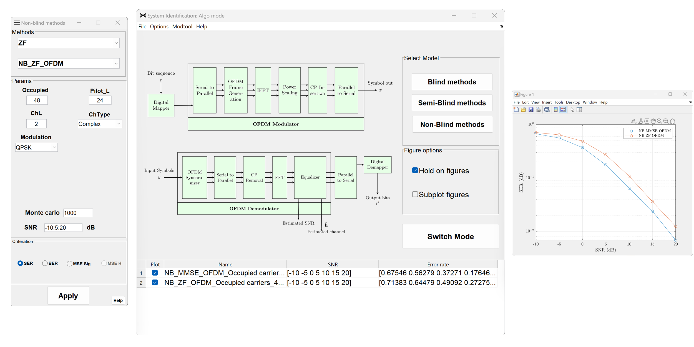

# **InSI**

> A MatLab Toolbox for Informed System Identification in Wireless Communications

[Getting Started](README.md)
[Download](https://github.com/avitech-vnu/InSI/archive/refs/heads/master.zip)
