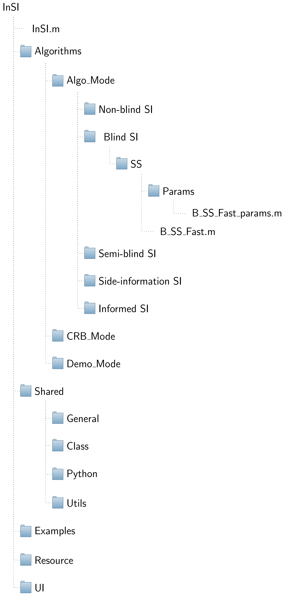
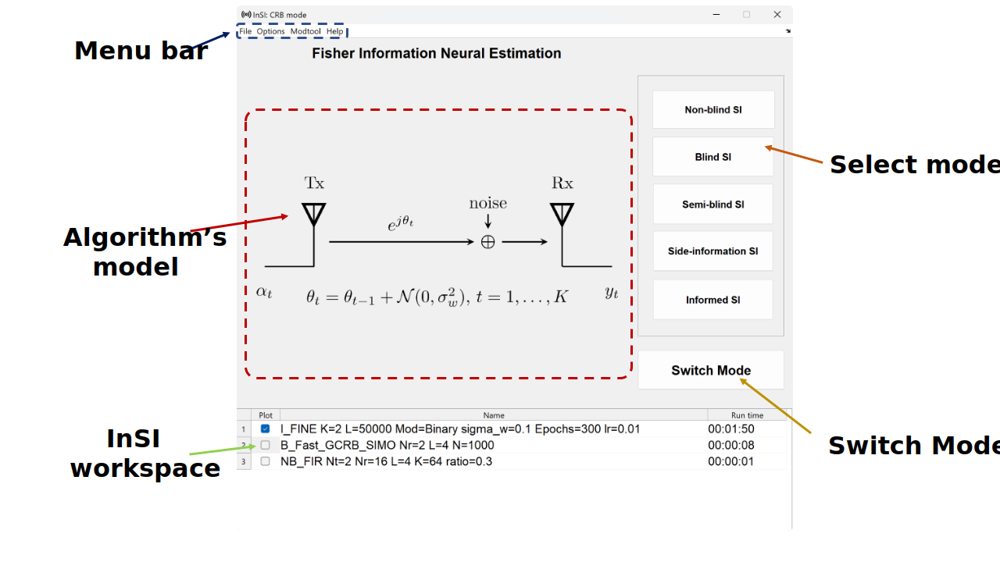
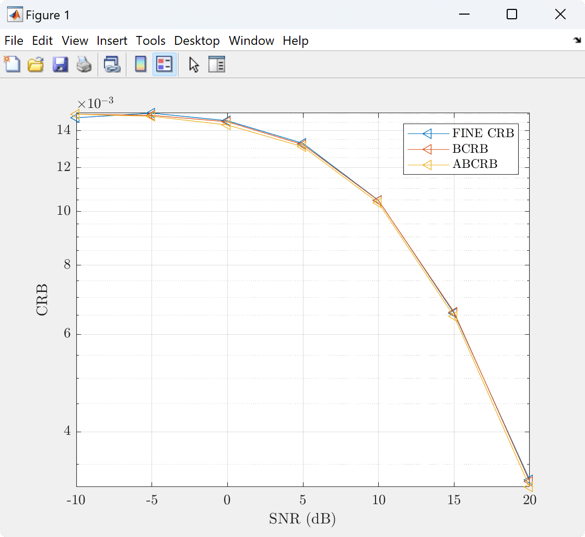

#
> # **InSI specifications**

Supporting both professional and particular users, this toolbox, thus, is designed for research and development as well as teaching. We target at its easy use and extensive capabilities as follows:

- **Interface**:
    - Interaction: algorithms in telecommunications are often in abstract form and not intuitive for beginners (e.g., students) to understand their input parameters. Therefore, we emphasize visualization in our toolbox. For example, when the user selects a parameter, a corresponding animation will be shown up on the system model so that the user can observe the effect of this parameter. Therefore, for each algorithm, a system model along with its parameter sets and the interactions must be included.
            
    - Independence: 
        - Algorithms: each study often has different assumptions and experiment conditions. Thus, in this toolbox, we divide the chosen algorithms into independent modules, with their proportionate parameter sets, system models, default values, and so forth to bring the results closest to the original study. Furthermore, the separation of algorithms from each other helps to add or remove algorithms without affecting the other algorithms. This module feature is useful for further extensions of  toolbox.
                    
        - Mode: this toolbox has three modes (i.e., performance analysis, algorithms and demo). Since these modes have different operations, interfaces, and running-times,  we separate their source codes independently.
- **Algorithms**:
    - Description: for reproducible research, we add notes about the input/output, and pseudo code of the algorithm (in a separate document) at the top of the functions as per the standard MatLab recommendations [help].
            
    - Example: parameter sets in the experiments of the original paper are added as "default values" and a hands-on example is also provided.
            
    - Reference: the original paper and related works are cited in each  function description.
        
- **InSI_modtool**: The InSI toolbox comes packaged with InSI_modtool, a small GUI utility used to create user-defined algorithms.

- **MatLab support**: we try to use common built-in functions to support older versions of MatLab as much as possible. Most functions are selected to work with MatLab from the R2006 version. However, we recommend using MatLab versions higher than 2014.

> # **InSI Graphical User Interface (GUI)**

## Application architecture

<b>
Figure 1. InSI architecture.
</b>

Based on the above specifications, we separated the toolbox architecture into four layers as shown in figure 1.

- **GUI**: when InSI is initialized, users can choose the mode, i.e., Algorithms, Performance, or Demo. Each mode corresponds to the dashboard, input parameters, and output interface. Additionally, InSI\_modtool is our small utility in GUI to create user-defined algorithms.
    
- **Data**: this layer is a bridge between GUI (user) and Algorithms (back-end). InSI operates by gathering input variables from the GUI and consolidating them into a predefined data structure, which is then transmitted to the back-end algorithm for processing. After execution, the output of algorithm functions are values of "x" and "y" axis, which are stored in the data layer. Subsequently, the GUI handles "Figure options" specified by the user, retrieves data from the data layer, and ultimately presents the result figures to the user.
    
- **Algorithms**: Figure 2 presents a dictionary tree of InSI. All algorithms of the three modes are stored in the "Algorithms" folder. They are divided by mode and model; each is attached with a parameters file. For example, in Figure 2, the function of the blind approach of fast subspace algorithm is named "B\_SS\_Fast" stored in the folder Blind group and Algo mode. This means this function is a blind channel estimation method, and its version is "Fast", which stands to separate from other subspace algorithm versions.

<b>
Figure 2. Dictionary tree of InSI.
</b>

## Dashboard interface

<b>
Figure 3. InSI dashboard.
</b>

Corresponding to the Modes, the toolbox will show the user a dashboard as shown in Figure 3. This dashboard is divided into five areas as follows:

1. **Menu bar**: this menu bar offers several useful functions, including figure options, font selection, font size adjustment, and toolbox help. For instance, under figure options, users have the flexibility to choose between three options, i.e., either they can retain all results within a single figure by using the "combine" feature, or they can plot each result in its individual figure using "single" or "separate" feature. These futures do the same functions as two MatLab built-in commands, i.e., *hold on* and *subplot*.
    
2. **Algorithm's model**: this dashboard presents a real-time updated image of the system model, which dynamically reflects the algorithm in use. Additionally, the system model allows interactive interactions with the selected input parameters.
    
3. **InSI workspace**: the results are not only displayed on the figure but also saved in a separate workspace. In addition, the user can also hide/show the lines on the figure from this workspace.
    
4. **Select model**: the available algorithms/functions are divided into five groups, i.e., Non-blind (NB), Blind (B), Simi-blind (SB), Side-information (Side-In), and Informed (Inf).
        
5. **Switch Mode button**: the users can switch between Performance/Algorithms/Demo mode by this button if they are missed in the first step.

## Input parameters interface

<b>
Figure 4. InSI input parameters menu.
</b>

After selecting the NB / B / SB / Side-In / Inf in the Dashboard interface, the corresponding input parameters GUI will appear as illustrated in Figure 4. This GUI is divided into five areas as follows:

1. **Algorithm**: the top box displays the name of the algorithm, while the box below indicates the version corresponding to the selected algorithm. For instance, it could be Gradient (Grad) version of CMA algorithm.
    
2. **Parameters**: based on the algorithm and version, pre-defined parameters are displayed in the "Params area". These parameters can appear as a drop-list for the user to select or a box for the user to enter from the keyboard. When the user selects/modifies the value boxes, the dashboard GUI interacts to illustrate that parameter on the algorithm's model. The maximum number of the input parameters is 10.
    
3. **Output types**: the user can choose the type of algorithm's output, i.e., Bit error rate (BER), Symbol error rate (SER), Mean square error signal (MSE Sig), and Mean square error channel (MSE Ch).
    
4. **Execute button**: the function of execute button is to collect all parameters in the Input parameters area and transmit them to the back-end algorithm for further processing.

5. **Help button**: this button opens the document of the selected algorithm. The help dialog box not only displays the contents similar to the help command but also provides users with the option to directly access the original paper of the algorithm.

## Output interface

  
  

<b>
Figure 5. InSI output interface.
</b>

After receiving the results from the back-end algorithms, the toolbox plots/subplots them into a standard MatLab figure as shown in Figure 5. Similar to the standard plot in MatLab, this output is easy to modify. In Figure 5, all results are holding on in a figure that permits to compare the performance between the algorithms. On the other hand, separated figure mode divides the results into different figures.

## InSI_modtool interface

<b>
Figure 6. InSI modtool.
</b>

InSI\_modtool is a utility we have developed to enable users to create their own custom algorithms. This utility is structured into two distinct steps, illustrated in Figure 6. In the first step, as depicted in the left-hand side figure, users select the mode, model, output types, and define the algorithm's name. Following this, in the second step, as shown in the right-hand side figure, users can sequentially define the required parameters. The output of this utility is a folder containing the template of the algorithm's code, system model, and parameters file.

[help]: https://www.mathworks.com/help/matlab/matlab_prog/add-help-for-your-program.html