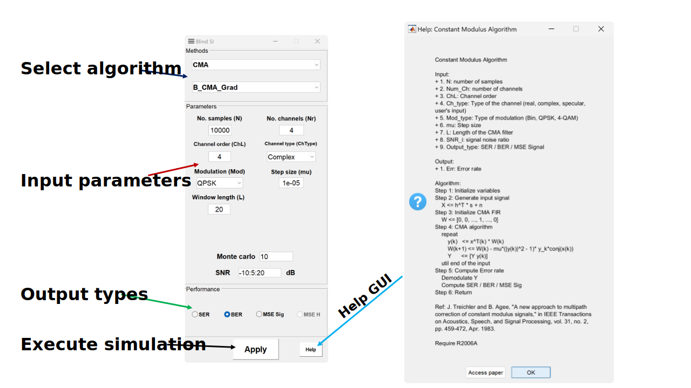

#
# InSI specifications

Supporting both professional and particular users, this toolbox, thus, is designed for research and development as well as teaching. We target at its easy use and extensive capabilities as follows:

- **Interface**:
    - Interaction: algorithms in telecommunications are often in abstract form and not intuitive for beginners (e.g., students) to understand their input parameters. Therefore, we emphasize visualization in our toolbox. For example, when the user selects a parameter, a corresponding animation will be shown up on the system model so that the user can observe the effect of this parameter. Therefore, for each algorithm, a system model along with its parameter sets and the interactions must be included.
            
    - Independence: 
        - Algorithms: each study often has different assumptions and experiment conditions. Thus, in this toolbox, we divide the chosen algorithms into independent modules, with their proportionate parameter sets, system models, default values, and so forth to bring the results closest to the original study. Furthermore, the separation of algorithms from each other helps to add or remove algorithms without affecting the other algorithms. This module feature is useful for further extensions of  toolbox.
                    
        - Mode: this toolbox has three modes (i.e., performance analysis, algorithms and demo). Since these modes have different operations, interfaces, and running-times,  we separate their source codes independently.
- **Algorithms**:
    - Description: for reproducible research, we add notes about the input/output, and pseudo code of the algorithm (in a separate document) at the top of the functions as per the standard MatLab recommendations [help].
            
    - Example: parameter sets in the experiments of the original paper are added as "default values" and a hands-on example is also provided.
            
    - Reference: the original paper and related works are cited in each  function description.
        
- **InSI_modtool**: The InSI toolbox comes packaged with InSI_modtool, a small GUI utility used to create user-defined algorithms.

- **MatLab support**: we try to use common built-in functions to support older versions of MatLab as much as possible. Most functions are selected to work with MatLab from the R2006 version. However, we recommend using MatLab versions higher than 2014.

# InSI Graphical User Interface (GUI)

## Application architecture

Based on the above specifications, we separated the toolbox architecture into three layers as shown in figure \ref{fig:architecture}:

- GUI: when the toolbox is initialized, the user can choose the MODE as shown in figure \ref{fig:guide}. Each MODE corresponds to the dashboard, input parameters, and output interface. For more details, see \ref{dashboard}, \ref{params}, and \ref{output}.
    
- Data: this layer is a bridge between GUI (user) and Algorithms (back-end). The GUI collects input variables from UI, then combine them into a pre-defined data structure and sends them to the back-end algorithm. After execution, the output of algorithm functions are values of "x" and "y" axes and they are stored in the data layer. Next, the GUI process "Figure options" from the user. It then gets data from the data layer, and finally displays the result figures.
    
- Algorithms: Figure \ref{fig:dir} presents a dictionary tree of the toolbox. Every algorithm of three MODEs is stored in the "Algorithms" folder. They are divided by MODE and Model and each of them is attached with a parameters file. For example, in Figure \ref{fig:dir}, the function of the CMA algorithm is named "B\_CMA\_adap" stored in the folder Blind Model and Algo MODE. This means this function is a blind channel estimation method, and its version is "adap" which stands for adaptive.

## Dashboard interface

## Input parameters interface

## Output interface

## InSI_modtool interface

[help]: https://www.mathworks.com/help/matlab/matlab_prog/add-help-for-your-program.html