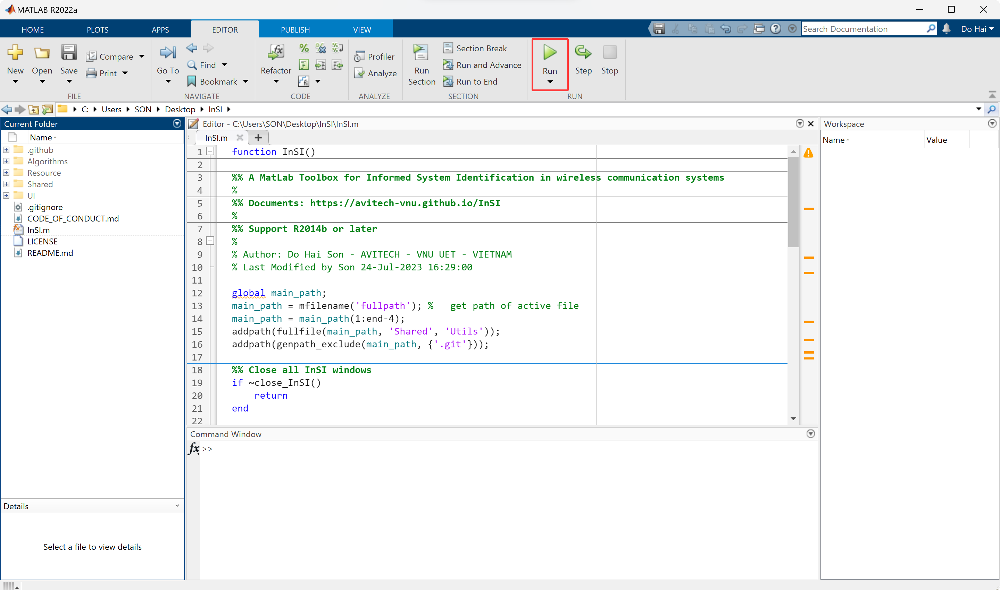
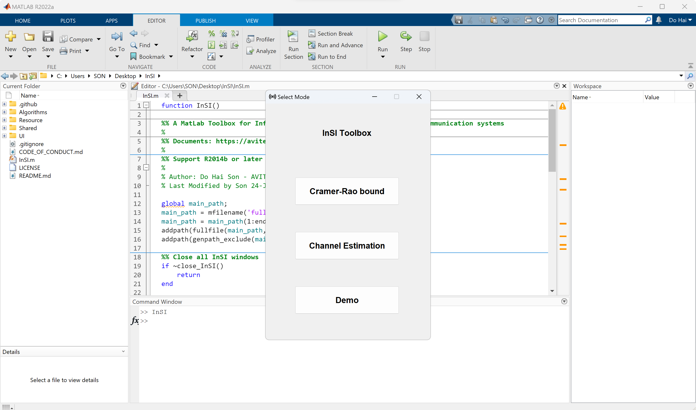

# Quick start

## Download the latest release of InSI

- Option 1: Download via git client.
```terminal
$|git clone https://github.com/avitech-vnu/InSI --depth 1
```
- Option 2: Download via .zip file and extract this file then.

> [https://github.com/avitech-vnu/InSI/archive/refs/heads/master.zip](https://github.com/avitech-vnu/InSI/archive/refs/heads/master.zip)

## Run InSI

- Open Matlab and change the current folder to the InSI folder.

<p style="text-align-last: center">

</p>

- Run the InSI.m script file.

## Select mode

<p style="text-align-last: center">

</p>

- Select the mode in the interface. There are three modes: Cramer-Rao bound (Performance), Channel Estimation (Algorithm), and Demo.

## Select model, algorithm, and execute

<p style="text-align-last: center">

</p>

- According to the approach, the algorithms are divided into five groups, i.e., Non-blind (NB), Blind (B), Simi-blind (SB), Side-information (Side-In), and Informed (Inf). Users then select the model / algorithm and its parameters to execute the simulations. The output is shown up in a standard figure of MATLAB.