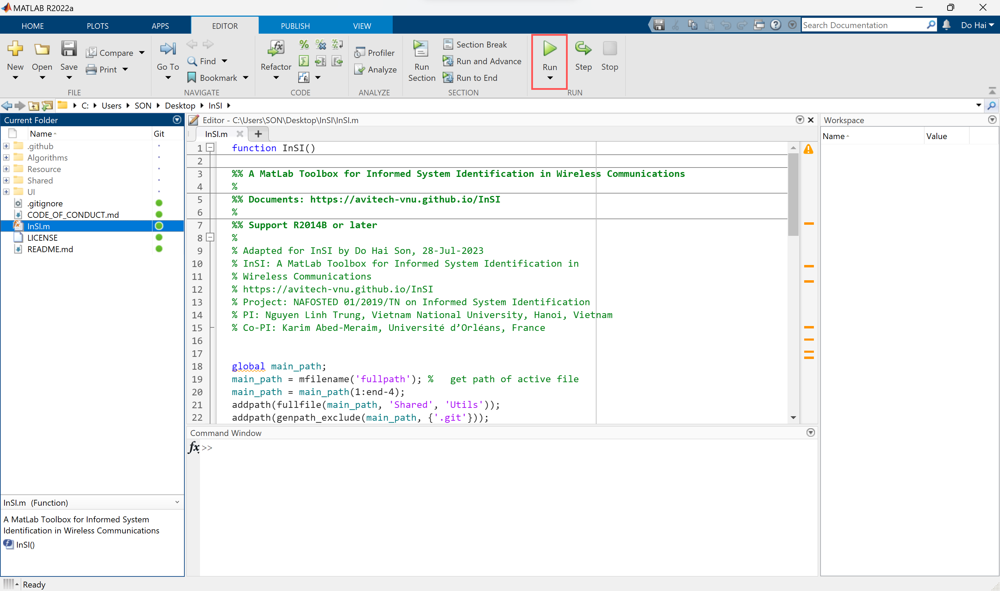
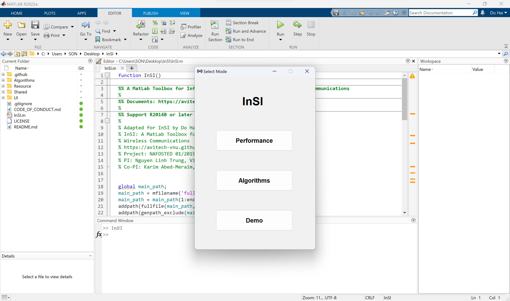

# Quick start

## Download the latest release of InSI

- Option 1: Download via git client.
```terminal
$|git clone https://github.com/avitech-vnu/InSI -b v1.3.0 --depth 1
```
- Option 2: Download via .zip file and extract this file then.

> [https://github.com/avitech-vnu/InSI/archive/refs/tags/v1.3.0.zip](https://github.com/avitech-vnu/InSI/archive/refs/tags/v1.3.0.zip)

## Run InSI

- Open Matlab and change the current folder to the InSI folder.

<p style="text-align-last: center">

</p>

- Run the InSI.m script file.

## Select mode

<p style="text-align-last: center">

</p>

- Select the mode in the interface. There are three modes: Cramer-Rao bound (Performance), Channel Estimation (Algorithm), and Demo.

## Select model, algorithm, and execution

<p style="text-align-last: center">

</p>